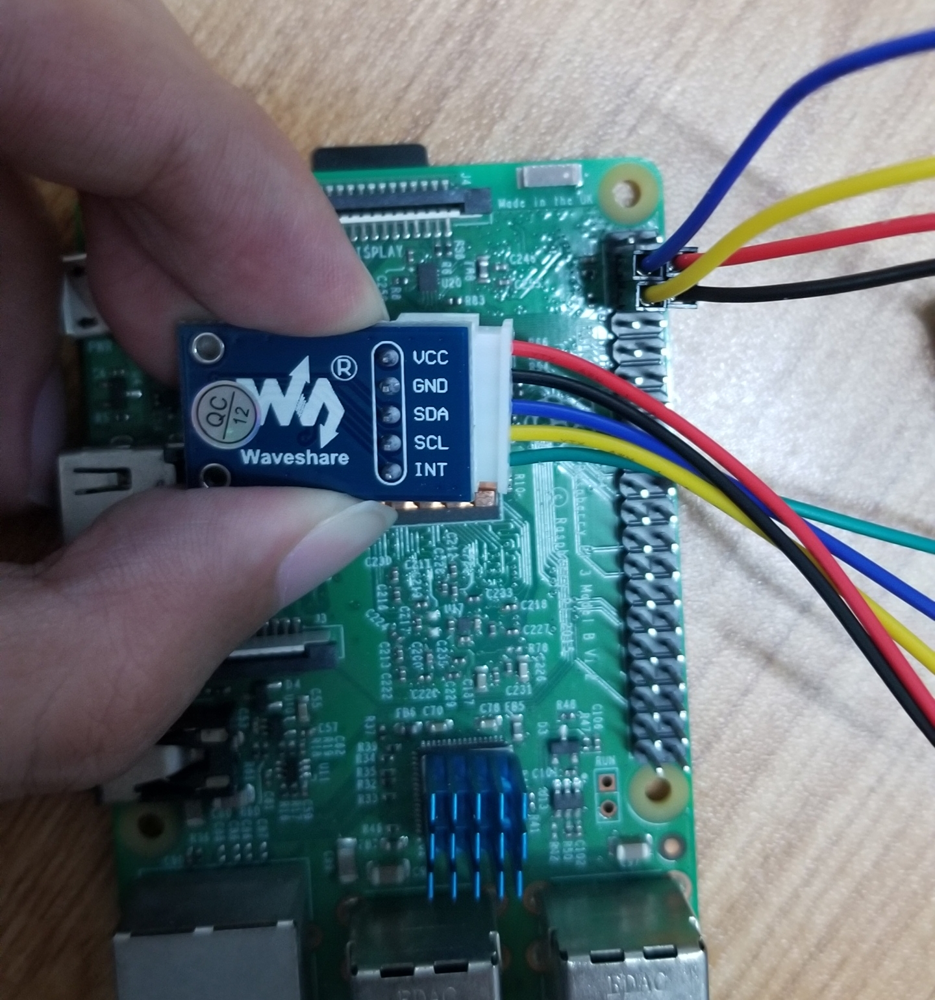

### 环境光传感器tsl2581
* 型号：微雪tsl2581
* 特点：i2c数据传输

### 与树莓派连线参考


### 运行
运行于`python3`环境，树莓派自带`smbus`，一般无需额外模块。<br>
测试时执行`python3 tsl2581.py`

作为模块导入:
```
from tsl2581 import TSl2581

# 初始化
sensor = TSl2581(1, 0x39)
sensor.power_on()
time.sleep(2)
sensor.config()
# 读取数据
sensor.read_channel()
data = sensor.calculateLux()
```
